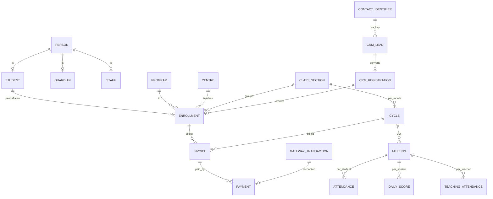
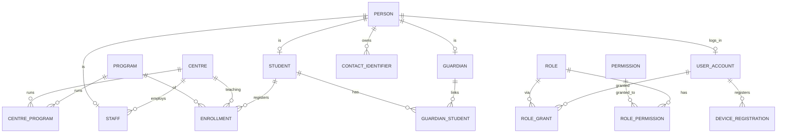
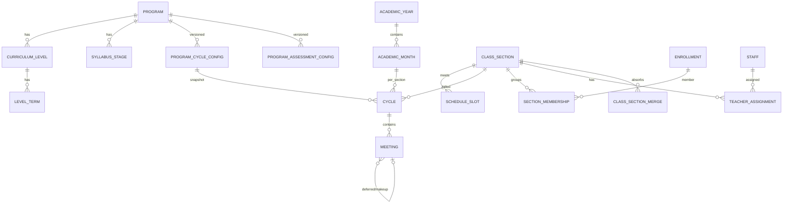
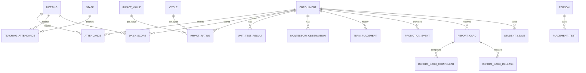
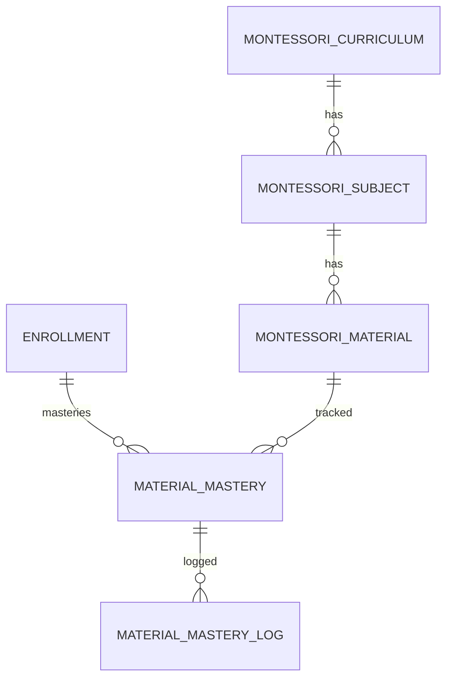
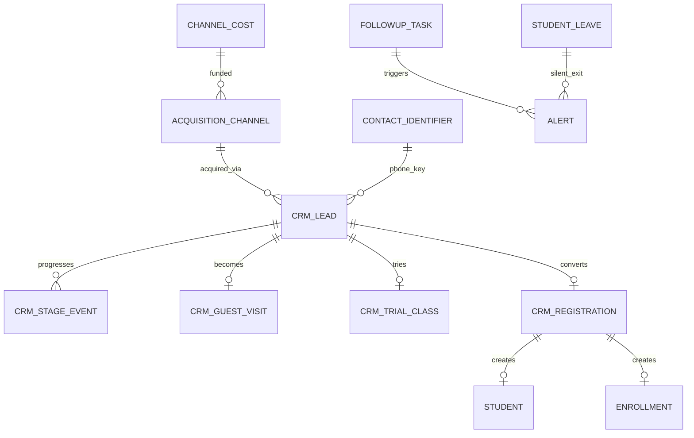
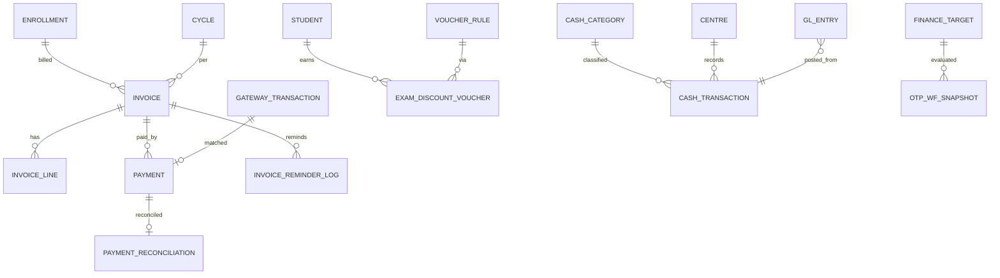

# 02 — Domain Model & Struktur Entity

DBMS: **PostgreSQL 16+** (aplikasi utama). Moodle tetap MySQL/MariaDB sendiri (lihat D9 untuk jembatan).
Semua tabel: PK `uuid` (boleh di-generate klien untuk baris yang lahir luring), audit columns standar, `COMMENT ON` wajib.

Legenda kolom di bawah: **PK** primary key · **FK** foreign key · **UQ** unique · **VO** versioned/append-only · **OFF** boleh dibuat offline (PK dari klien).

---

## D1 — Identity, Person, Access

| Entity | Kolom kunci | Catatan |
|---|---|---|
| `centre` | id PK, code UQ, name, is_hq, address, phone | 7 centre; Entrop = HQ |
| `program` | id PK, code UQ, name, study_mode enum(formal, non_formal) | 7 program |
| `centre_program` | centre_id, program_id UQ(both), academic_mode | centre jalankan sebagian program |
| `person` | id PK, full_name, gender, birth_date, place_of_birth, npwp?, status | **satu baris = satu manusia** |
| `contact_identifier` | id PK, person_id FK, channel enum(whatsapp,email,phone), value_normalized UQ(channel,value_normalized), is_verified | **nomor WA = kunci funnel CRM**; dinormalisasi (E.164) |
| `student` | person_id PK/FK, student_code UQ, is_active | person yang pernah/sedang terdaftar |
| `guardian` | person_id PK/FK | wali; bisa juga guru/staff (person tunggal, peran berganda) |
| `guardian_student` | guardian_id, student_id UQ(both), relationship enum, is_primary, can_view_billing, can_see_all_siblings | 1 wali >1 anak; 1 anak >1 wali |
| `staff` | person_id PK/FK, staff_code UQ, hire_date, employment_status, centre_id FK(home), is_payroll_eligible | 115 staf |
| `staff_position` | id PK, staff_id FK, position enum(supper_admin,education_consultant,teacher_coordinator,finance_coordinator,teacher,other), centre_id, valid_from VO, valid_to | posisi berganti → riwayat |
| `enrollment` | id PK, student_id FK, program_id FK, teaching_centre_id FK, billing_centre_id FK, study_mode enum, cycle_entry_id FK(cycle masuk), placement_level_id, placement_term_id, status enum(active, on_leave, graduated, dropped_out, transferred), enrolled_at, ended_at, exit_reason_code | **satu siswa = N enrollment lintas program/centre**. `enrollment_id` = "pendaftaran" = satuan tagihan & laporan per centre |
| `enrollment_exit` | id PK, enrollment_id FK, exited_at, reason_code UQ-ref, notes, recorded_by | alasan wajib → alert "berhenti tanpa alasan" |
| `user_account` | id PK, person_id FK UQ, username UQ, password_hash, mfa_secret?, status, last_login_at | 1 person 1 akun; peran via grant |
| `role` | id PK, code UQ (student, guardian, teacher, teacher_coordinator, education_consultant, finance_coordinator, centre_admin, super_admin) | |
| `permission` | id PK, code UQ (score.daily.view, score.daily.write, attendance.write, invoice.issue, ...) | |
| `role_permission` | role_id, permission_id UQ(both) | |
| `role_grant` | id PK, user_id FK, role_id FK, centre_id FK NULL(=global) UQ(user,role,centre), valid_from, valid_to | **scoping per centre di sini**; guru: scope tambahan = kelas ditugaskan (computed, lihat `v_teacher_section`) |
| `device_registration` | id PK, user_id FK, device_token UQ, platform enum(android,ios,web,laptop), registered_at, revoked_at, revocation_reason, wipe_requested_at | cabut akses → flag wipe → dieksekusi pada sync berikutnya (D9) |
| `moodle_user_link` | user_id FK + moodle_user_id UQ(both), moodle_username, last_synced_at, status | jembatan SSO & provisioning |

Aturan domain D1:
- `student`, `guardian`, `staff` adalah **subtypes** dari `person` (table-per-subtype; 1 orang bisa wali sekaligus guru).
- Jumlah siswa organisasi = `count(*) from student` (orang unik). Jumlah siswa per centre = `count(*) from enrollment where teaching_centre_id=? and status active`. Dua-duanya wajib ada di laporan, berlabel jelas.

## D2 — Kurikulum: Level, Term, dan Konfigurasi Berversi

| Entity | Kolom kunci | Catatan |
|---|---|---|
| `curriculum_level` | id PK, program_id FK, level_no UQ(program,level_no), name (mis. "Kids 1", "Key 2"), is_active | tangga level |
| `level_term` | id PK, level_id FK, term_no UQ(level,term_no), name (mis. "Term 3"), syllabus_stage_id FK NULL | **1 term = 1 bulan akademik** |
| `syllabus_stage` | id PK, program_id FK, code UQ, name, order_no | "tahapan silabus" — pengatur kenaikan Calistung/Montessori |
| `program_cycle_config` | id PK, program_id FK, effective_from DATE UQ(program, effective_from), meetings_per_cycle SMALLINT, classes_per_year SMALLINT, note, superseded_at VO | **rule #3: ubah 10→8 = INSERT baris baru, baris lama tak tersentuh** |
| `program_assessment_config` | id PK, program_id FK, effective_from UQ(program, effective_from), daily_score_scale='1-5', unit_test_frequency enum(per_term, per_2_terms, at_stage_completion, none), mock_interval_terms INT NULL, promotion_mode enum(automatic, teacher_decided), readiness_min_score NUMERIC default 3.0 | matriks Bagian 5 per program |

## D3 — Delivery: Kalender, Kohort, Siklus, Meeting

| Entity | Kolom kunci | Catatan |
|---|---|---|
| `academic_year` | id PK, year UQ, starts_on, ends_on | |
| `academic_month` | id PK, year_id FK, seq_no UQ(year,seq_no), starts_on, ends_on, name | **bisa menyeberang bulan kalender** |
| `calendar_holiday` | id PK, date UQ, name, is_national | Friday-shift & makeup rules |
| `class_section` | id PK, code UQ, program_id FK, centre_id FK, name, status enum(active, merged, closed), formed_on, closed_on | **kohort = siswa yang sama walau guru berganti** |
| `section_membership` | id PK, section_id FK, enrollment_id FK, valid_from VO, valid_to, reason_code enum(enrolled, demoted, early_promotion, schedule_change, merged_in, split_out) UQ(enrollment,valid_from) | OFF-able: murni server |
| `class_section_merge` | id PK, target_section_id FK, source_section_id FK, merged_on, note | riwayat gabungan kelas saat jumlah turun |
| `schedule_slot` | id PK, section_id FK, day_of_week enum(mon..sat), group_code enum(A,B,FRIDAY_ROTATION), start_time, room, effective_from, effective_to | Grup A Sen/Rab, B Sel/Kam, Jumat bergantian |
| `cycle` | id PK, section_id FK, academic_month_id FK, config_id FK **snapshot** `program_cycle_config`, meetings_planned (disalin saat buka siklus), status enum(open, locked, closed), opened_by, opened_at | **satu cycle = satu bulan akademik satu section** = unit penagihan |
| `meeting` | id PK, cycle_id FK, seq_no UQ(cycle,seq_no), scheduled_date, slot_id FK NULL, group_code, is_makeup bool, makeup_for_meeting_id FK NULL, deferred_from_meeting_id FK NULL, holiday_id FK NULL, status enum(scheduled, held, cancelled) | deterministik: generator cycle menulis baris final. Jumat kena libur → `deferred_from_meeting_id` + baris Jumat berikut; kurang → `is_makeup=true` hari Sabtu |
| `teacher_assignment` | id PK, section_id FK, staff_id FK, role enum(teacher, substitute, coordinator_observing) UQ(section,staff,valid_from), valid_from VO, valid_to, assigned_by, note | **rule #4: guru berganti tiap bulan, kohort tetap** |

## D4 — Presensi, Penilaian, Rapor

Semua baris penilaian/presensi: `OFF` (PK dari klien), `UNIQUE` pelindung duplikat sync, dan masuk daftar tabel ber-audit trigger.

| Entity | Kolom kunci | Catatan |
|---|---|---|
| `attendance` | id PK, meeting_id FK, enrollment_id FK, status enum(present, absent, leave, sick), note, recorded_by FK user, recorded_at, device_id FK, source enum(online, offline_sync) UQ(meeting, enrollment) | 13 siswa/kelas, 1 layar, 1 batch |
| `teaching_attendance` | id PK, meeting_id FK, staff_id FK, role enum(teacher, substitute) UQ(meeting, staff, role), hours? default per meeting, recorded_by, recorded_at, source OFF | **dasar Tunjangan Actual Teaching (rule #5,#6)** — presensi kerja TIDAK ada di sistem ini |
| `daily_score` | id PK, meeting_id FK, enrollment_id FK, score NUMERIC(3,2) CHECK 1.00–5.00, note, recorded_by, recorded_at, source UQ(meeting, enrollment) OFF | 1 nilai/pertemuan/observation umum. **Hanya guru + coordinator boleh baca (rule #9)** |
| `impact_value` | id PK, code UQ (6 nilai IMPACT), name, order_no, rubric_desc | dari rubrik |
| `impact_rating` | id PK, enrollment_id FK, cycle_id FK, impact_value_id FK, score 1–5 UQ(enrollment, cycle, value) OFF | sekali per siklus |
| `unit_test_result` | id PK, enrollment_id FK, level_id FK, term_id FK, score 1–5, readiness_flag bool (score>=3.0), tested_at, recorded_by UQ(enrollment, term) | batas kesiapan 3.0, **tidak memblokir** |
| `cambridge_mock_sitting` | id PK, program_id FK, name, sitting_date, mock_index INT | jadwal per program |
| `cambridge_mock_result` | id PK, sitting_id FK, enrollment_id FK, score, band, certificate_ref UQ(sitting, enrollment) | |
| `montessori_observation` | id PK, enrollment_id FK, observed_on, staff_id FK, note_text (kualitatif harian) OFF | Montessori = tanpa angka |
| `term_placement` | id PK, student_id FK, enrollment_id FK, from_level_id, from_term_id, to_level_id, to_term_id, valid_from VO, reason enum(placement_test, promotion, early_promotion, demoted, schedule_change, re_entry), decided_by FK, note | riwayat penuh pindah level/term |
| `promotion_event` | id PK, promotion_scope enum(section, enrollment), section_id NULL, enrollment_id NULL, from_term_id FK, to_term_id FK, mode enum(automatic, teacher_decided), decided_by FK, decided_at, below_readiness_flag bool, note_text NOT NULL when flag | **rule #10: tidak pernah blokir; flag + catatan wajib & tampil terbuka** |
| `report_card` | id PK, enrollment_id FK, level_id FK, term_id FK, cycle_id FK, status enum(draft, published), published_at, published_by UQ(enrollment, term) | rapor per term |
| `report_card_component` | id PK, report_card_id FK, source enum(attendance_summary, daily_avg, unit_test, impact, teacher_comment), value_text, value_num | komponen agregasi |
| `report_card_release` | id PK, report_card_id FK, recipient_user_id FK, role_view enum(student, guardian), released_at, seen_at | kontrol siapa melihat apa (rule #9 + notifikasi WA "rapor terbit") |
| `placement_test` | id PK, person_id FK, lead_id FK NULL, centre_id FK, speaking_score, written_score, result_level_id FK, result_term_id FK, tested_at, tested_by | menentukan level & term awal siswa baru |
| `student_leave` | id PK, enrollment_id FK, start_date, end_date, reason_code, approved_by | bahan **hitung cuti voucher** & retensi |

## D5 — Mutu Pengajaran (Teacher Quality)

| Entity | Kolom kunci | Catatan |
|---|---|---|
| `coordinator_assignment` | id PK, coordinator_id FK staff, teacher_id FK staff, valid_from VO, valid_to UQ(teacher, valid_from) | 1 coordinator : 5–8 guru (assert saat grant) |
| `observation_rubric` | id PK, version UQ, dimension_code UQ(version,dimension), weight, max_score | |
| `teaching_observation` | id PK, teacher_id FK, section_id FK, cycle_id FK, meeting_id FK NULL, observer_id FK, score 1–5, rubric_id FK, findings jsonb, followup_note, observed_at | ≥2/bulan/guru → dihitung di view |
| `tdi_snapshot` | id PK, staff_id FK, cycle_id FK, components jsonb, composite_score, computed_at UQ(staff, cycle) **append-only** | Teacher Development Index, recomputable tapi tak pernah di-ubah |
| `monthly_quality_review` | id PK, centre_id FK, program_id FK, cycle_id FK, coordinator_id FK, attendance_metric jsonb, retention_metric jsonb, score_summary jsonb, notes, reviewed_at UQ(coordinator, cycle, program) | evaluasi bulanan coordinator |

## D6 — Kerangka Montessori (user-definable, Curriculum → Subject → Material)

Struktur **bisa dibuat & dihapus pihak akademik Montessori**, jadi: soft-archive (tak pernah hard delete), urutan eksplisit, dan setiap penguasaan menyimpan snapshot saat kerangka berubah.

| Entity | Kolom kunci | Catatan |
|---|---|---|
| `montessori_curriculum` | id PK, centre_id FK NULL(=global), name, code UQ, is_archived, archived_at | framework root |
| `montessori_subject` | id PK, curriculum_id FK, name, code, order_no UQ(curriculum, code), is_archived | |
| `montessori_material` | id PK, subject_id FK, name, code UQ(subject, code), description, order_no, age_band, is_archived | |
| `material_mastery` | id PK, enrollment_id FK, material_id FK, status enum(presented, practiced, mastered) UQ(enrollment, material) OFF | status 3 tingkat |
| `material_mastery_log` | id PK, mastery_id FK, from_status, to_status, changed_by, changed_at OFF | append-only; "Presented" juga tercatat first_presented_at |

## D7 — CRM: Funnel Lead → Guest → Trial → Registrasi

| Entity | Kolom kunci | Catatan |
|---|---|---|
| `acquisition_channel` | id PK, name, type enum(org_event, referral, social, ads, website, jotform_embed, word_of_mouth, other), is_active | kanal akuisisi |
| `channel_cost` | id PK, centre_id FK NULL, channel_id FK, period (date_trunc month) UQ(centre, channel, period), amount | untuk **CPA** |
| `crm_lead` | id PK, centre_id FK, contact_identifier_id FK (WA = kunci) , person_id FK NULL, channel_id FK NOT NULL (**wajib**), status enum(new, contacted, guest, trial_scheduled, trialed, won, lost, expired, merged) , owner_staff_id FK, source_ref (jotform id / sheet row) , lost_reason, created_at | |
| `crm_stage_event` | id PK, lead_id FK, from_stage, to_stage, occurred_at, recorded_by **append-only** | riwayat funnel → corong per kanal |
| `crm_guest_visit` | id PK, lead_id FK, visited_at, host_staff_id FK, programme_interest jsonb, notes UQ(lead, visited_at) | Guest |
| `crm_trial_class` | id PK, lead_id FK, section_id FK NULL, trial_date, outcome enum(attended, no_show, converted), feedback | Trial class |
| `crm_registration` | id PK, lead_id FK UQ, student_id FK, enrollment_id FK NOT NULL, registered_at, form_data jsonb (snapshot formulir Jotform lama) | **registrasi → create person/student/enrollment dalam 1 transaksi, tanpa re-entry** |
| `followup_task` | id PK, lead_id FK, due_at, completed_at, assigned_to, note | pemicu alert "belum ditindaklanjuti / lewat batas" |
| `alert_rule` | id PK, code UQ(lead_unfollowed, lead_overdue, silent_exit, otp_breach, wf_breach, obs_quota_short), params jsonb, target_role | |
| `alert` | id PK, rule_id FK, subject_ref (lead_id / enrollment_id / centre_id), raised_at, resolved_at, resolved_by, note | dasbor admin centre |
| `whatsapp_escalation` | id PK, lead_id FK NULL, enrollment_id FK NULL, centre_id FK, conversation_ref (chatwoot id) UQ, summary, severity enum(low, med, high), status enum(open, assigned, resolved), assigned_staff_id FK, received_at, resolved_at | eskalasi chatbot → Portal Admin centre |
| `crm_kpi_snapshot` | id PK, period, centre_id, program_id NULL, metrics jsonb, computed_at UQ(period, centre, program) **append-only** | 8 indikator utama, funnel per kanal, CPA, retensi — recomputable, tak pernah di-ubah |

## D8 — Keuangan

| Entity | Kolom kunci | Catatan |
|---|---|---|
| `cash_category` | id PK, centre_id FK NULL(=global), name, direction enum(in, out), is_active, is_system | kategori configurable per centre |
| `cash_transaction` | id PK, centre_id FK, occurred_on DATE, category_id FK, direction enum(in, out), amount NUMERIC(14,2), method enum(cash, transfer, ewallet, qris, other), ref_no, description, recorded_by, reversed_at, reversal_of_id FK NULL, source OFF | kas harian per centre. Pembalikan pakai baris reversal, **bukan delete** |
| `invoice_series` | id PK, program_id FK, study_mode enum(formal, non_formal), centre_id NULL, prefix, next_no (server-side generator) | nomor invoice **tidak pernah dari klien** (aman terhadap sync terlambat) |
| `invoice` | id PK, invoice_no UQ, enrollment_id FK, centre_id FK, program_id FK, cycle_id FK UQ(enrollment, cycle), issue_date, due_date, amount, amount_paid (generated/derived view), status enum(draft, issued, partially_paid, paid, overdue, void), voided_at, void_reason | **diterbitkan otomatis bulanan dari enrollment aktif** — 1 enrollment 1 invoice per cycle |
| `invoice_line` | id PK, invoice_id FK, description, amount | item: SPP, materi, ujian |
| `exam_discount_voucher` | id PK, student_id FK, rule_id FK, qualifying_window_from, qualifying_window_to, amount, status enum(issued, used, expired, void), issued_at, used_invoice_id FK NULL, used_at | |
| `voucher_rule` | id PK, min_continuous_months, max_leave_months, amount, effective_from UQ(triple) | rule 12 bln tanpa cuti = 1,2 jt; ≤1 bln cuti = 600 rb; >1 bln = reset (tanpa baris = tak memenuhi) |
| `payment` | id PK, centre_id FK, student_id FK NULL, invoice_id FK NULL, amount, method enum(transfer, ewallet, qris, cash, gateway, voucher), gateway_txn_id FK NULL, paid_at, confirmed_by, reversed_at UQ(gateway_txn) | pembayaran manual (tunai/transfer) tetap ada |
| `gateway_config` | id PK, provider enum(midtrans, xendit), mode enum(sandbox, production), purpose enum(collection, disbursement), api_keys_ref (vault path, bukan secret di DB) | |
| `gateway_transaction` | id PK, provider, ext_ref UQ(provider, ext_ref), idempotency_key UQ, invoice_id FK NULL, amount, currency, channel enum(bank_transfer, ewallet, qris, ...), status enum(pending, settled, failed, refunded, expired), raw jsonb, created_at, settled_at | webhooks → upsert by ext_ref/idempotency_key |
| `payment_reconciliation` | id PK, gateway_txn_id FK UQ, payment_id FK, matched_by enum(auto, manual), matched_at, variance NUMERIC | auto-match: nominal + VA/QRIS payload + invoice ref; gagal → antre manual |
| `finance_target` | id PK, centre_id FK, program_id FK NULL, period UQ(centre, program, period), otp_min NUMERIC(5,2) default 85.00, wf_max NUMERIC(5,2) default 0.40 | target OTP/WF, configurable |
| `otp_wf_snapshot` | id PK, period, centre_id, program_id, otp_pct, wf_pct, waiting_fund_count, on_time_count, total_billable, computed_at UQ(period, centre, program) **append-only** | dihitung otomatis bulanan; laporan per program & per centre |
| `invoice_reminder_log` | id PK, invoice_id FK, sent_at, channel enum(whatsapp), template_code, external_msg_id, recipient_user_id | pengingat H-x sebelum due date via WA |
| `gl_entry` | id PK, occurred_on, account enum(cash, revenue_spp, revenue_material, revenue_exam, discount_voucher, expense_...), debit, credit, source_type enum(cash_txn, invoice, payment, voucher), source_id, centre_id, program_id | **buku besar minimal** untuk arus kas + laba rugi per program/centre. Semua jurnal dari transaksi bisnis, tidak pernah entri manual kecuali `is_adjustment=true` + alasan |

Alur kunci: cycle dibuka → enrollment aktif tagih per `invoice_series` → gateway/ manual payment → reconciliation → status invoice (lunas/sebagian/menunggak) → snapshot OTP & WF bulanan vs target → alert breach.

## D9 — Platform: Audit, Lock, Sync, Integrasi, Konfigurasi

| Entity | Kolom kunci | Catatan |
|---|---|---|
| `audit_log` | id BIGINT PK, table_name, row_id uuid, action enum(insert, update, delete), before jsonb, after jsonb, actor_user_id, actor_device_id, occurred_at, source enum(ui, offline_sync, system, import) | **trigger-based**; di-partition bulanan; retensi ≥360 hari |
| `period_lock` | id PK, lock_type enum(teaching_attendance, cycle, invoice_run, report_card_run) , centre_id FK, program_id FK NULL, cycle_id FK, locked_by, locked_at, unlocked_by NULL, unlocked_at, unlock_reason NOT NULL when unlock **append-only** | export tunjangan hanya saat locked |
| `unlock_request` | id PK, lock_id FK, reason, requested_by, approved_by, approved_at | post-lock change harus lewat sini (Q4) |
| `sync_batch` | id PK, user_id FK, device_id FK, started_at, finished_at, item_count, applied_count, rejected_count, status enum(open, done, partial) | |
| `sync_item` | id PK, batch_id FK, client_op_id UQ, entity, row_id uuid, op enum(insert, update), payload jsonb, base_version INT, applied_at, error_code, error_note | **client_op_id = kunci idempotensi** (rule #7) |
| `row_version` | entity + row_id UQ(both), version, updated_at | optimistic concurrency untuk update luring |
| `moodle_sync_state` | id PK, entity_type enum(user, course, course_enrollment, teacher_enrollment), entity_id uuid, moodle_id, last_synced_at, status enum(pending, ok, failed, revoked), error_note, retry_count | provisioning akun/course/teacher otomatis dari event SIS |
| `sso_session` | id PK, subject_ref user_id, issued_at, expires_at, revoked_at, revoked_reason, wp_token_hash | cabut akses siswa → revoke di sini + job revoke Moodle |
| `notification_log` | id PK, channel enum(whatsapp, email, push), template_code, recipient_user_id, subject_ref(table,row_id), external_msg_id, sent_at, status, error | rapor terbit, kelas pengganti, pengingat, eskalasi |
| `import_batch` | id PK, source enum(google_sheets, jotform, csv), file_ref, rows_total, rows_ok, rows_failed, error_report jsonb, imported_by, imported_at | seed awal siswa & pendaftaran aktif |
| `system_config` | id PK, key, scope enum(global, centre) + centre_id NULL, value jsonb, updated_by, updated_at UQ(key, scope, centre_id) | reminder lead days, threshold alert, dsb |
| `sequence_counter` | name PK, next_val | nomor invoice/label server-side, atomic |

---

## ERD mermaid

### Ringkasan lintas domain

### D1 Identity & Access

### D2–D3 Kurikulum & Delivery

### D4 Presensi & Penilaian

### D6 Montessori

### D7 CRM

### D8 Keuangan

---

## View laporan (nama final di `900_indexes_constraints.sql`)

| View | Definisi | Menjawab |
|---|---|---|
| `v_enrollment_count_per_centre` | count(enrollment) aktif per centre | "jumlah siswa per centre" |
| `v_unique_student_org` | count(distinct person student) | "jumlah siswa organisasi" |
| `v_attendance_rate` | per centre/program/cycle | evaluasi coordinator |
| `v_teaching_allowance(cycle)` | aggregation teaching_attendance where cycle locked | dasar Tunjangan Actual Teaching |
| `v_daily_score_visibility` | join ke observer role, **tidak expose ke guardian** | rule #9 |
| `v_otp_wf` | per bulan/centre/program | target 85% / 0.4% |
| `v_cpa_by_channel` | channel_cost / won registrations | CRM |
| `v_retention` | exit vs active per cohort | CRM + mutu |
| `v_teacher_section(user)` | section aktif via teacher_assignment valid_now | scope guru |
| `v_observation_quota` | observasi/bulan vs minimal 2 | runbook coordinator |
