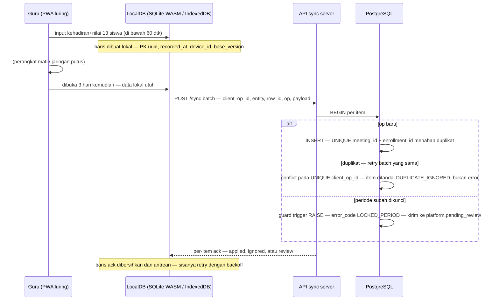

# 03 — Strategi Offline-Sync, Audit & Periode Terkunci

Dokumen teknis untuk vendor/DBA. Merujuk tabel di `db/ddl/005`, `008`, `009`, `900`.

---

## 1. Alur luring (module guru, PWA)

### Aturan inti
1. **PK UUID dibuat di klien.** Server tidak pernah menolak karena "ID belum ada"; baris luring & daring memakai ruang ID yang sama.
2. **`sync_item.client_op_id` UNIQUE = idempotensi.** Klien menyimpan op-id per aksi; kirim ulang batch lama menjadi no-op (`DUPLICATE_IGNORED`). Ini jawaban struktural untuk "pengiriman dua kali tidak tercatat dua kali".
3. **UNIQUE domain sebagai lapis kedua:** `attendance(meeting_id, enrollment_id)`, `daily_score(meeting_id, enrollment_id)`, `teaching_attendance(meeting_id, staff_id, role)`. Dua perangkat guru berbeda mengirim baris yang sama → hanya satu masuk.
4. **Update luring memakai `base_version`** (tabel `platform.row_version`). Versi basi → `VERSION_CONFLICT`, klien tarik state server lalu tanyakan ke pengguna (bukan overwrite diam-diam).
5. **Nomor manusia (invoice_no, student_code) terbit di server**, bukan klien — `sequence_counter` / `invoice_series.next_no` atomik. Klien luring tidak pernah perlu nomor final.
6. **Perangkat dicabut** (`device_registration.revoked_at` + `wipe_requested_at`): respons sync berikutnya berisi instruksi `wipe`; klien menghapus LocalDB lalu ACK dengan `wiped_at`. Data yang sempat terkirim tidak terhapus (audit source = device id).

## 2. Data yang tiba setelah periode dikunci

Kasus riil: guru input di hari terakhir, sync 3 hari kemudian saat coordinator sudah mengunci presensi untuk ekspor tunjangan.

1. Guard trigger menolak INSERT? — **tidak untuk insert**; INSERT baru legal (hanya UPDATE/DELETE yang diguard) — tetapi `platform.ifx_locked_meeting_guard` di-aktifkan juga bila meeting-nya berstatus `cancelled`.
2. Bila ditolak (`LOCKED_PERIOD`): baris masuk `pending_review` + alert ke Super Admin centre. **Data tidak hilang**, ada di `sync_item.payload` (jsonb) sebagai bukti mentah.
3. Jalur resmi koreksi: `unlock_request` (alasan, empat-mata: requester ≠ approver) → admin approve → guard melonggar untuk cycle itu → apply koreksi → re-lock (baris `period_lock` baru). Seluruh jejak: siapa, kapan, alasan, before/after.

## 3. Audit trail

- Trigger `platform.ifx_audit()` pada: `daily_score`, `teaching_attendance`, `attendance`, `cash_transaction`, `invoice`, `payment`, `material_mastery`.
- Isi per baris: `before`/`after` (jsonb penuh), `actor_user_id`, `actor_device_id`, `occurred_at`, `source` ∈ (ui | offline_sync | system | import).
- Konteks transaksi diisi aplikasi: `SET LOCAL app.user_id / app.device_id / app.source` → trigger baca via `current_setting`.
- `audit_log` dipartisi bulanan (`ensure_audit_partition()` via cron) — retensi minimal 360 hari, selaras kebijakan cadangan.
- Tabel konfigurasi & riwayat (append-only) diproteksi `ifx_append_only()`: `program_cycle_config`, `program_assessment_config`, `crm_stage_event`, `term_placement` (delete), `teacher_assignment` (delete), `period_lock` (delete), `sync_item`.

## 4. Locking cycle runbook (bulanan, sesuai Bagian 11)

| Langkah | Aksi di DB |
|---|---|
| 1. Buka siklus | INSERT `cycle` (snapshot `config_id`, `meetings_planned`) + generate 10 baris `meeting` (aturan Jumat/Sabtu dieksekusi generator) |
| 2. Input berjalan | guru insert attendance/daily_score (luring/daring) |
| 3. Kunci presensi mengajar | INSERT `period_lock(lock_type='teaching_attendance', cycle)` → guard aktif → **export `v_teaching_allowance`** |
| 4. Terbit invoice | job: enrollment aktif per cycle → `invoice` (UNIQUE enrollment+cycle anti-dobel) + `gl_entry` |
| 5. Rekonsiliasi | webhook gateway → `gateway_transaction` → auto-match `payment` + `payment_reconciliation`; sisa → antre manual |
| 6. Snapshot OTP/WF | INSERT `otp_wf_snapshot`; bandingkan `finance_target` → `alert` bila breach |
| 7. Terbit rapor | `report_card` → published + `report_card_release` per penerima → `notification_log` WA "rapor terbit" |
| 8. Cabut perangkat | UPDATE `device_registration` revoke + wipe flag; `sso_session` revoke; `moodle_sync_state` revoked |

## 5. Target kecepatan input (≤60 detik / 13 siswa / offline)

- Layar = daftar 13 siswa enrollment aktif per meeting (1 query, hasil bisa di-cache offline saat buka daftar hadir).
- Aksi default "hadir" — guru hanya menyentuh yang tidak: ketuk status per siswa = 1 tap; nilai = segmented 1–5 = 1 tap; simpan = 1 tombol.
- 13 siswa × ±1–2 tap + 1 simpan ≈ 20–35 tap < 10 detik interaksi; insert = 1 batch upsert ke LocalDB (bukan 13 roundtrip).
- Submit ke server dilakukan antrean sync, **bukan** di jalur ketukan — jadi lambat jaringan tidak memengaruhi waktu input.
- Schema mendukung ini: kolom wajib per baris minimal (`meeting_id, enrollment_id, status/score`), sisanya di-derive server (centre_id, recorded_by dari sesi).
